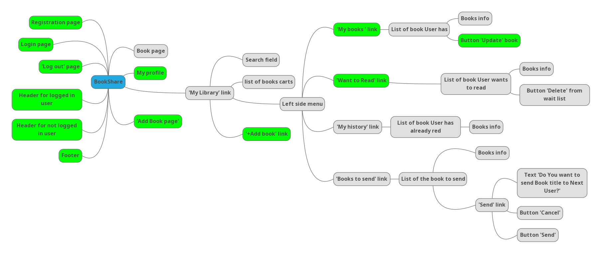

# BookSharing

The BookSharing is an online service.
Made for people who love to read and who have a lot of books they would like to share with.
A registered user can add his books to the library and also getting from other users. 
When transferring a book, there is also a transfer of temporary rights to it. 
After reading the book, the user is obliged to send it to the next user,
who is in line for this book.

The test project is developed according to the [application requirements](https://docs.google.com/document/d/1qS2nE6eYz-0MswMzk-eEY7f5bnkT8LFIYknpaJLFoAE/edit?usp=drive_link)
and [functional requirements](https://app.diagrams.net/#G1CrpUxmWZwFm6MBLW17g9Vtl-ajKilM_-) that created schematically in the form of page layouts.

According to the requirements, a map of the main functionality for testing was created.

The programs, tools and frameworks for testing what were used in project:
development environment IntelliJ IDEA, programming language Java, build system Gradle, 
framework for testing TestNG, driver for testing system Selenium, version control system GitHub,
continuous Integration Server Jenkins, for documentation Google document and google spreadsheets,
for diagrams MindMap, google diagrams, test management TestLink, Jira.

                                     

Testing will be based on test cases, including positive and negative scenarios.
When we receive a new build of the application, we will start work with Smoke testing.
State transition diagrams and Pairwise will be used as a software testing methodology.

All test project describes [Test Plan](https://docs.google.com/document/d/1D5jcdyrv96tUdze5YWdlHociLneN7YNa/edit?usp=drive_link&ouid=109104427040351955730&rtpof=true&sd=true).

